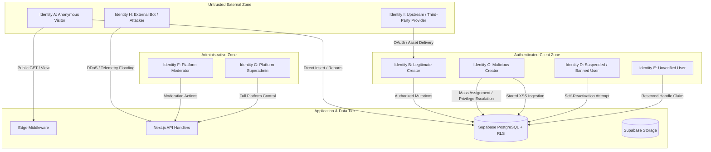

# Threat Model & Identity Security Architecture — Link-in-Bio

**Date**: September 7, 2026  
**Assessment Standard**: STRIDE Threat Modeling & OWASP Top 10 Security Architecture  
**Application**: Link-in-Bio Creator Platform

---

## 1. Executive Threat Landscape Overview

The Link-in-Bio platform hosts multi-tenant public profile pages, dynamic link blocks, external media embeds, visitor analytics telemetry, and administrative moderation pipelines. The trust boundary is divided between:
1. **Untrusted Internet / Client Tier**: Web browsers, anonymous visitors, external bots, and client-side JavaScript executing in user browsers.
2. **Edge / Reverse Proxy Tier**: Vercel Edge Middleware handling hostname inspection and URL rewrites.
3. **Application Serverless Tier**: Next.js App Router server endpoints handling authenticated requests via request-scoped and service-role clients.
4. **Data & Storage Tier**: Supabase PostgreSQL database (enforcing Row Level Security) and Supabase Storage.

---

## 2. Comprehensive Identity Threat Profiles (Identities A through I)

---

### Identity A: Anonymous Public Visitor (Unauthenticated)

- **Description**: Unauthenticated end-user visiting creator profiles via browser, webview (Instagram, TikTok, Twitter/X), or automated link preview bot.
- **Legitimate Goals**: View published profiles, click creator links, consume embedded media, submit legitimate abuse reports.
- **Malicious Capabilities**:
  - Direct HTTP requests to Supabase REST endpoints using `NEXT_PUBLIC_SUPABASE_ANON_KEY`.
  - Crafting arbitrary payloads to `/api/analytics` and `/api/reports/submit`.
  - Probing for unpublished/draft profiles and unlisted content.
- **Attack Surface & Entrypoints**:
  - `/[username]` public SSR profile endpoint.
  - `/api/analytics` telemetry ingestion endpoint.
  - `/api/reports/submit` and direct `reports` table insertion via Supabase REST API.
  - `resolve_custom_domain` RPC callable via public anon key.
- **Potential Blast Radius**:
  - Ingestion flooding / database exhaustion via `reports` table spam.
  - Skewing creator telemetry metrics (fake views/clicks).
  - Exploiting Stored XSS delivered via creator profiles to steal cookies or compromise visitors.
- **High-Risk Threat Vectors**:
  - **Vector A.1: Direct Reports Table Flooding**: RLS policy `Anyone can submit a report` allows arbitrary anonymous inserts directly to `reports` bypassing the API rate limiter.
  - **Vector A.2: Analytics Telemetry Poisoning**: Submitting spoofed client tokens and referrers to exhaust database IOPS.

---

### Identity B: Authenticated Standard User / Creator (Legitimate Account Owner)

- **Description**: Registered creator managing their personal link-in-bio page, themes, and configuration.
- **Legitimate Goals**: Build and customize profile, publish links, upload avatar, monitor analytics, update account settings.
- **Trust Level**: Low (Client-side execution is completely untrusted).
- **Attack Surface & Entrypoints**:
  - `/dashboard/*` suite.
  - Direct Supabase client calls via `supabase.from('profiles')` and `supabase.from('blocks')`.
  - File upload via `supabase.storage.from('avatars')`.
  - `/api/account/actions` and `/api/account/delete`.
- **Potential Blast Radius**:
  - Compromise of own account data, loss of followers/traffic if account is hijacked or deleted.
- **High-Risk Threat Vectors**:
  - **Vector B.1: Session Hijacking via XSS**: Injected script on public pages exfiltrates `sb-<ref>-auth-token` from `localStorage`.
  - **Vector B.2: Irreversible Account Deletion**: `/api/account/delete` deletes user and auth credentials without verifying current password.

---

### Identity C: Authenticated Standard User / Attacker (Malicious Creator)

- **Description**: Malicious actor who signs up for a legitimate free account to attack the platform, other creators, or visitors.
- **Malicious Goals**: Privilege escalation to superadmin, unauthorized profile verification (`is_verified = true`), un-banning own suspended content, cross-site scripting (XSS), domain hijacking.
- **Capabilities**: Full access to browser DevTools, Supabase client session tokens, network traffic manipulation, and automated scripting.
- **Attack Surface & Entrypoints**:
  - Direct mutations on `profiles`, `blocks`, and `custom_domains` using their authenticated JWT.
  - Input fields for `bio`, `display_name`, `username`, and `socials`.
  - Block data payload inputs (URLs, titles, captions).
- **Potential Blast Radius**:
  - Full platform compromise (superadmin escalation).
  - Mass Stored XSS infecting all visitors of attacker's profile.
  - Phishing attacks using verified badge status or hijacked custom domains.
- **High-Risk Threat Vectors**:
  - **Vector C.1: Stored XSS via JSON-LD Structured Data**: Attacker sets `display_name` or `bio` to `</script><script>...` which escapes the `<script type="application/ld+json">` tag in `app/[username]/page.js`.
  - **Vector C.2: Mass Assignment Privilege Escalation**: Calling `supabase.from('profiles').update({ is_verified: true, account_status: 'active' }).eq('id', user.id)` directly via client SDK succeeds because Postgres RLS lacks column-level constraints.
  - **Vector C.3: Custom Domain Hijacking**: Inserting a row in `custom_domains` with `verified: true` and an arbitrary target domain redirects visitors via `middleware.js`.
  - **Vector C.4: Moderation Flag Tampering**: Calling `supabase.from('blocks').update({ is_disabled: false }).eq('id', blockId)` re-enables a block disabled by platform moderators.

---

### Identity D: Authenticated User with Suspended / Banned Status

- **Description**: Creator whose account or content has been penalized, suspended, or banned by Trust & Safety.
- **Malicious Goals**: Evade suspension, restore public profile availability, regain posting privileges, bypass moderation bans.
- **Capabilities**: Holds valid JWT session until token expiration; can send authenticated requests to database and API endpoints.
- **Attack Surface & Entrypoints**:
  - Direct update calls to `profiles` table.
  - Direct update/insert calls to `blocks` table.
  - Public profile visibility checks.
- **Potential Blast Radius**:
  - Complete invalidation of Trust & Safety enforcement.
- **High-Risk Threat Vectors**:
  - **Vector D.1: Self-Reactivation via Direct RLS Update**: Because `profiles for update` only checks `auth.uid() = id`, a suspended user can execute `.update({ account_status: 'active', suspension_reason: null })` directly from browser console, bypassing admin sanctions.

---

### Identity E: Unverified / Newly Registered User (Email Not Confirmed)

- **Description**: User who completed initial registration or OAuth initiation but has not confirmed email ownership.
- **Malicious Goals**: Sybil account creation, reserved handle squatting, impersonation of high-profile entities.
- **Capabilities**: Can receive OAuth redirect callbacks or trigger signup requests.
- **Attack Surface & Entrypoints**:
  - `/signup` submission handler.
  - `/auth/callback` automatic profile generator.
  - `/onboarding` handle selector.
- **Potential Blast Radius**:
  - Squatting administrative handles (`admin`, `security`, `support`, `official`).
- **High-Risk Threat Vectors**:
  - **Vector E.1: Reserved Handle Squatting via OAuth / Onboarding**: `app/auth/callback/page.js` and `app/onboarding/page.js` insert handles into `profiles` without verifying against `reserved_usernames`. An attacker using Google OAuth with email `admin@example.com` automatically seizes the `@admin` handle.

---

### Identity F: Platform Moderator (Internal Role: `moderator`)

- **Description**: Internal Trust & Safety operator assigned to review abuse reports and disable offensive links.
- **Legitimate Goals**: Review user reports, dismiss false reports, disable violating blocks.
- **Intended Limitations**: Should NOT be able to delete user accounts, alter global platform settings, toggle feature flags, or delete system audit logs.
- **Attack Surface & Entrypoints**:
  - `/admin/*` pages.
  - `/api/admin/*` endpoints.
- **Potential Blast Radius**:
  - Accidental or malicious disruption of platform infrastructure, unauthorized user account deletion.
- **High-Risk Threat Vectors**:
  - **Vector F.1: Horizontal / Vertical Admin Privilege Escalation**: `/api/admin/users` allows ANY caller where `verifyAdminUser` returns true to delete user accounts. A moderator can invoke `action: 'delete_user'` on any creator or fellow administrator.
  - **Vector F.2: Platform Configuration Tampering**: `/api/admin/settings` does not restrict `action: 'toggle_flag'` or `action: 'update_setting'` to superadmins. A moderator can toggle platform feature flags or enable maintenance mode.

---

### Identity G: Platform Superadmin (Internal Role: `superadmin`)

- **Description**: Platform owner with unrestricted root administrative access to all data, settings, logs, and user credentials.
- **Legitimate Goals**: Maintain platform health, manage feature flags, configure global settings, audit team actions.
- **Blast Radius**: Total platform destruction, irreversible data loss, mass credential compromise.
- **High-Risk Threat Vectors**:
  - **Vector G.1: Hardcoded Email Escalation Backdoor**: `lib/adminAuth.js` and `app/admin/layout.js` grant automatic superadmin rights to `pmkaulani@gmail.com` or `NEXT_PUBLIC_ADMIN_EMAIL`. If email confirmation is disabled or OAuth provider does not verify emails, an attacker registering this email takes over the entire platform.
  - **Vector G.2: Email Exposure in Client Bundle**: `NEXT_PUBLIC_ADMIN_EMAIL` is baked into public client JavaScript bundles, exposing the administrator's email to targeted phishing and credential stuffing.

---

### Identity H: Malicious External Actor (Network Attacker, Botnet, Scraper)

- **Description**: Automated threat actor operating outside the platform with no credentials.
- **Malicious Goals**: Distributed denial of service (DDoS), credential stuffing, content scraping, bypassing rate limits.
- **Capabilities**: Distributed IP infrastructure, headless browser automation, HTTP request spoofing.
- **Attack Surface & Entrypoints**:
  - `/api/analytics`
  - `/api/reports/submit`
  - `/login` password brute force
- **Potential Blast Radius**:
  - Cloud infrastructure billing spikes, database IOPS exhaustion, application downtime.
- **High-Risk Threat Vectors**:
  - **Vector H.1: Serverless In-Memory Rate Limiter Bypass**: The in-memory sliding-window maps in `app/api/analytics/route.js` and `app/api/reports/submit/route.js` are not shared across serverless execution instances. Attacking across multiple lambdas or rotating headers completely bypasses rate limits.
  - **Vector H.2: IP Header Spoofing**: Rate limiters split `X-Forwarded-For` on `,` and use the first element. An attacker injecting custom `X-Forwarded-For` headers can rotate arbitrary IPs.

---

### Identity I: Upstream Service / Supply Chain Provider

- **Description**: External third parties delivering core functionality: Supabase (Auth/DB/Storage), Vercel (Hosting/Edge), Google OAuth, Google Fonts CDN, Cloudflare CDN.
- **Malicious Goals / Failure Modes**: Third-party outage, compromised CDN script/font, unauthorized OAuth token issuance.
- **Attack Surface & Entrypoints**:
  - Next.js CSP configuration (`style-src`, `font-src`, `connect-src`, `frame-src`).
  - Google OAuth token exchange.
- **Potential Blast Radius**:
  - Client-side code injection via CDN compromise, application downtime during Supabase outages.
- **High-Risk Threat Vectors**:
  - **Vector I.1: CSP `'unsafe-inline'` and `'unsafe-eval'` Relaxation**: `next.config.js` permits `'unsafe-inline'` and `'unsafe-eval'`. Any injected script executes without CSP restriction.
  - **Vector I.2: Service-Role Key Fallback to Anon Key**: `lib/supabaseAdmin.js` falls back to `NEXT_PUBLIC_SUPABASE_ANON_KEY` if `SUPABASE_SERVICE_ROLE_KEY` is missing in environment, causing administrative calls to fail or execute with unprivileged anon scope.
